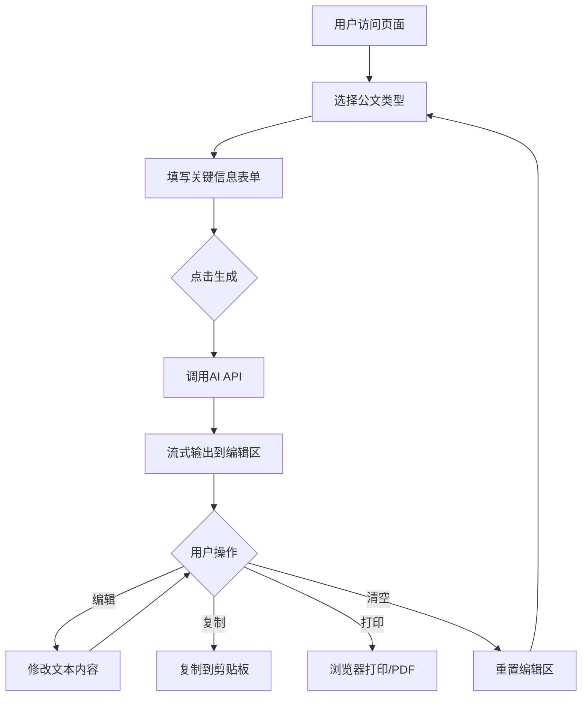
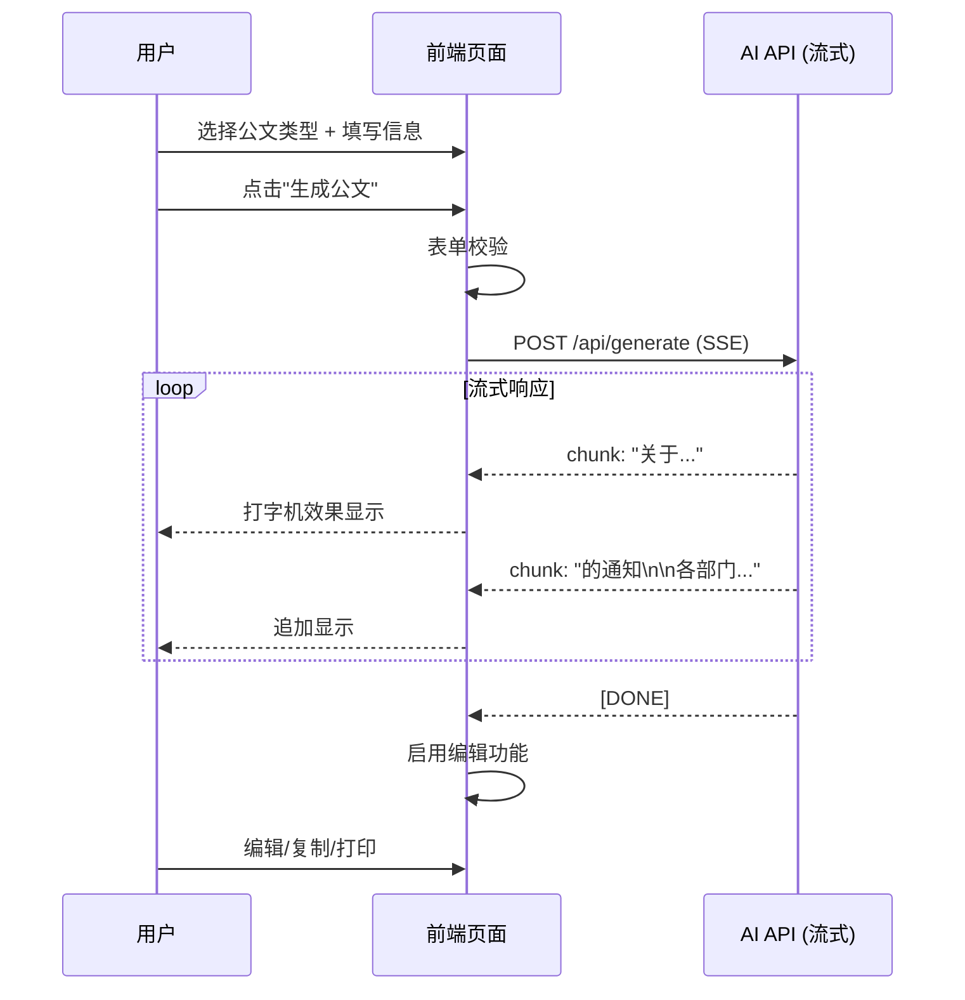

# 广西现代物流集团有限公司公文智能起草助手 - 产品需求文档

> 版本：V1.0 MVP
> 创建日期：2025-01-08
> 状态：已确认，待开发

---

## 一、产品路线图 (Product Roadmap)

### 1.1 核心目标 (Mission)

**让企业行政人员一键生成规范公文，告别反复核对格式的痛苦。**

### 1.2 用户画像 (Persona)

| 属性 | 描述 |
|------|------|
| **身份** | 广西现代物流集团行政人员、办公室文员、部门秘书 |
| **核心痛点** | 写公文时需反复核对格式规范（字体、字号、行距、称谓等），耗时易出错 |
| **期望** | 输入关键信息，自动生成符合国标的规范公文 |

### 1.3 V1: 最小可行产品 (MVP)

| 功能 | 描述 |
|------|------|
| **公文类型选择** | 6种类型：通知、请示、报告、合同、会议纪要、工作总结 |
| **智能表单** | 根据公文类型动态显示必填字段 |
| **AI流式生成** | 调用AI API，打字机效果实时输出公文内容 |
| **格式化输出** | 直接生成标准字号、字体、格式的文字（GB/T 9704-2020） |
| **在线编辑** | 生成内容可直接编辑修改 |
| **一键复制** | 复制公文内容到剪贴板 |
| **一键清空** | 重置编辑区内容 |
| **浏览器打印** | 一键触发打印，可另存为PDF |
| **深浅模式切换** | 支持浅色/深色主题切换，默认浅色 |

### 1.4 V2 及以后版本 (Future Releases)

| 版本 | 功能 |
|------|------|
| **V2** | 一键导出Word (.docx) |
| **V2** | 一键导出PDF（服务端生成） |
| **V2** | 公文模板库（保存常用模板） |
| **V3** | 历史记录与云端同步 |
| **V3** | 用户账号系统 |
| **V4** | 团队协作、审批流程 |

---

## 二、关键业务逻辑 (Business Rules)

### 2.1 公文类型 → 表单字段映射

| 公文类型 | 必填字段 |
|---------|---------|
| **通知** | 发文单位、收文范围、通知事项要点、发文日期 |
| **请示** | 请示单位、上级机关、请示事由、具体请求 |
| **报告** | 报告单位、报告对象、报告内容要点 |
| **合同** | 甲方、乙方、合同标的、权利义务、有效期 |
| **会议纪要** | 会议名称、时间地点、参会人员、议题决议 |
| **工作总结** | 时间范围、工作内容、成果亮点、改进方向 |

### 2.2 格式标准 (GB/T 9704-2020)

| 元素 | 规范 |
|------|------|
| **标题** | 黑体/方正小标宋体，22pt，居中 |
| **正文** | 仿宋，16pt，行距28pt |
| **一级标题** | 黑体，16pt |
| **页边距** | 上37mm、下35mm、左28mm、右26mm |

---

## 三、数据契约 (Data Contract)

### 3.1 公文生成请求

```typescript
interface DocumentRequest {
  type: '通知' | '请示' | '报告' | '合同' | '会议纪要' | '工作总结';
  fields: {
    // 通知
    issuer?: string;        // 发文单位
    recipients?: string;    // 收文范围
    subject?: string;       // 通知事项要点
    date?: string;          // 发文日期

    // 请示
    requestor?: string;     // 请示单位
    superior?: string;      // 上级机关
    reason?: string;        // 请示事由
    request?: string;       // 具体请求

    // 报告
    reporter?: string;      // 报告单位
    reportTo?: string;      // 报告对象
    content?: string;       // 报告内容要点

    // 合同
    partyA?: string;        // 甲方
    partyB?: string;        // 乙方
    contractSubject?: string; // 合同标的
    obligations?: string;   // 权利义务
    validity?: string;      // 有效期

    // 会议纪要
    meetingName?: string;   // 会议名称
    timePlace?: string;     // 时间地点
    attendees?: string;     // 参会人员
    resolutions?: string;   // 议题决议

    // 工作总结
    period?: string;        // 时间范围
    workContent?: string;   // 工作内容
    achievements?: string;  // 成果亮点
    improvements?: string;  // 改进方向
  };
}
```

### 3.2 公文生成响应（流式）

```typescript
// Server-Sent Events (SSE) 格式
// 每个chunk为一段文本
data: {"content": "关于"}
data: {"content": "春节放假安排"}
data: {"content": "的通知\n\n"}
data: {"content": "各部门：\n"}
...
data: [DONE]
```

---

## 四、MVP 原型设计（方案C简化版）

```
┌──────────────────────────────────────────────────────────────────────────────┐
│  广西现代物流集团有限公司公文智能起草助手                      [🌙/☀️ 切换]  │
├──────────────────────────────────────────────────────────────────────────────┤
│                                                                              │
│                     ┌────────────────────────────────┐                       │
│                     │  ✨ 一键生成规范公文            │                       │
│                     │  AI智能起草，符合国标格式       │                       │
│                     └────────────────────────────────┘                       │
│                                                                              │
│      ┌──────┬──────┬──────┬──────┬──────┬──────┐                            │
│      │ 通知 │ 请示 │ 报告 │ 合同 │ 纪要 │ 总结 │                            │
│      └──●───┴──────┴──────┴──────┴──────┴──────┘                            │
│                                                                              │
│  ┌────────────────────────────────────────────────────────────────────────┐  │
│  │                                                                        │  │
│  │   发文单位 *                        收文范围 *                         │  │
│  │   ┌────────────────────┐           ┌────────────────────┐              │  │
│  │   │ 广西现代物流集团    │           │ 各部门、各子公司   │              │  │
│  │   └────────────────────┘           └────────────────────┘              │  │
│  │                                                                        │  │
│  │   通知事项要点 *                                                       │  │
│  │   ┌──────────────────────────────────────────────────────────────────┐ │  │
│  │   │ 请输入通知的核心内容要点，AI将为您生成完整规范公文...             │ │  │
│  │   └──────────────────────────────────────────────────────────────────┘ │  │
│  │                                                                        │  │
│  │                    ┌─────────────────────────────┐                     │  │
│  │                    │       ✨ 生成公文            │                     │  │
│  │                    └─────────────────────────────┘                     │  │
│  └────────────────────────────────────────────────────────────────────────┘  │
│                                                                              │
│  ┌────────────────────────────────────────────────────────────────────────┐  │
│  │  📄 公文内容（可直接编辑）                                              │  │
│  │  ┌──────────────────────────────────────────────────────────────────┐  │  │
│  │  │ 【字体：仿宋 | 字号：16pt | 行距：28pt】                          │  │  │
│  │  │                                                                  │  │  │
│  │  │                    关于XXXX的通知                                │  │  │
│  │  │                    （黑体 22pt）                                 │  │  │
│  │  │                                                                  │  │  │
│  │  │  各部门：                                                        │  │  │
│  │  │      根据公司工作安排，现将有关事项通知如下......▌               │  │  │
│  │  │                                                                  │  │  │
│  │  └──────────────────────────────────────────────────────────────────┘  │  │
│  │                                                                        │  │
│  │           ┌───────┐    ┌───────┐    ┌─────────────┐                   │  │
│  │           │ 📋复制 │    │ 🗑清空 │    │ 🖨打印/PDF  │                   │  │
│  │           └───────┘    └───────┘    └─────────────┘                   │  │
│  └────────────────────────────────────────────────────────────────────────┘  │
│                                                                              │
├──────────────────────────────────────────────────────────────────────────────┤
│  © 2025 广西现代物流集团有限公司  ·  格式标准：GB/T 9704-2020                 │
└──────────────────────────────────────────────────────────────────────────────┘
```

### 设计说明

| 设计决策 | 说明 |
|---------|------|
| **单页布局** | 上下垂直流动，视觉层次清晰 |
| **Tab切换** | 6种公文类型快速切换，动态更新表单字段 |
| **格式化编辑器** | 直接显示标准字号、字体的可编辑文本 |
| **流式输出** | 打字机效果，提升用户体验 |
| **三按钮操作** | 复制、清空、打印——覆盖核心操作 |
| **深浅模式** | 右上角切换按钮，默认跟随系统，支持手动切换 |

---

## 五、架构设计蓝图

### 5.1 核心流程图



### 5.2 AI生成时序图



### 5.3 项目目录结构

```
公文助理text/
├── app/
│   ├── layout.tsx              # 根布局
│   ├── page.tsx                # 主页面（公文起草助手）
│   ├── globals.css             # 全局样式
│   └── api/
│       └── generate/
│           └── route.ts        # AI生成API（流式）
├── components/
│   ├── ui/                     # shadcn/ui 基础组件
│   │   ├── button.tsx
│   │   ├── card.tsx
│   │   ├── input.tsx
│   │   ├── textarea.tsx
│   │   ├── tabs.tsx
│   │   └── ...
│   ├── header.tsx              # 页面头部导航
│   ├── footer.tsx              # 页面底部
│   ├── document-form.tsx       # 公文表单组件（核心）
│   ├── document-editor.tsx     # 公文编辑器组件（核心）
│   └── document-type-tabs.tsx  # 公文类型选择Tab
├── lib/
│   ├── utils.ts                # 工具函数
│   ├── prompts.ts              # AI提示词模板
│   └── document-types.ts       # 公文类型配置
├── data/
│   ├── site-config.json        # 站点配置
│   └── document-fields.json    # 公文字段配置
├── sources/                    # 参考模板（已有）
└── public/
    └── fonts/                  # 国标字体文件
        ├── FangSong.ttf
        └── SimHei.ttf
```

### 5.4 核心模块依赖关系

```
┌─────────────────────────────────────────────────────────────┐
│                        page.tsx                             │
│                      (主页面入口)                            │
└──────────────┬──────────────┬──────────────┬───────────────┘
               │              │              │
               ▼              ▼              ▼
┌──────────────────┐ ┌────────────────┐ ┌────────────────────┐
│ document-type-   │ │ document-      │ │ document-          │
│ tabs.tsx         │ │ form.tsx       │ │ editor.tsx         │
│ (类型选择)        │ │ (动态表单)     │ │ (编辑器+操作按钮)   │
└────────┬─────────┘ └───────┬────────┘ └─────────┬──────────┘
         │                   │                    │
         ▼                   ▼                    │
┌─────────────────────────────────────┐           │
│        document-types.ts            │           │
│   (公文类型 & 字段配置)              │           │
└─────────────────────────────────────┘           │
                                                  │
         ┌────────────────────────────────────────┘
         ▼
┌─────────────────────────────────────┐
│        api/generate/route.ts        │
│   (AI流式生成接口)                   │
└────────────────┬────────────────────┘
                 │
                 ▼
┌─────────────────────────────────────┐
│           prompts.ts                │
│   (各类型公文的Prompt模板)           │
└─────────────────────────────────────┘
```

### 5.5 现有文件影响分析

| 现有文件 | 影响 | 说明 |
|---------|------|------|
| `sources/header.tsx` | 参考 | 参考其Header设计风格，新建适配版本 |
| `sources/footer.tsx` | 复用 | 可直接复用，修改品牌信息 |
| `sources/hero-section.tsx` | 不使用 | 本项目是工具型，不需要Hero区 |
| `sources/features.tsx` | 不使用 | 不需要功能介绍区 |

### 5.6 技术选型

| 技术领域 | 选型 | 理由 |
|---------|------|------|
| **框架** | Next.js 14 (App Router) | 已有项目基础，支持API Routes |
| **UI组件** | shadcn/ui + Tailwind CSS | 已有项目基础，风格统一 |
| **AI接口** | OpenAI API / 兼容接口 | 支持流式输出(SSE) |
| **富文本编辑** | `contenteditable` + 自定义样式 | 轻量级，满足简单编辑需求 |
| **打印样式** | CSS `@media print` | 浏览器原生支持，无需后端 |
| **字体** | 仿宋、黑体（Web字体） | 满足国标格式要求 |

### 5.7 风险预判

| 风险 | 级别 | 应对策略 |
|------|------|----------|
| **AI API Key 暴露** | 高 | API调用必须走后端Route，前端不存储Key |
| **流式输出中断** | 中 | 前端做断点续传提示，显示"重新生成"按钮 |
| **Web字体加载慢** | 中 | 使用`font-display: swap`，优先显示系统字体 |
| **打印样式不一致** | 低 | 使用`@media print`精确控制，测试主流浏览器 |
| **移动端体验** | 低 | 响应式设计，但主要面向桌面端办公场景 |

---

## 六、确认清单

- [x] 核心目标已确认
- [x] 用户画像已确认
- [x] MVP功能范围已确认（V1不含导出Word/PDF）
- [x] V2+功能已规划
- [x] 业务规则已明确
- [x] 数据契约已定义
- [x] 原型设计已选定（方案C简化版）
- [x] 架构蓝图已完成
- [x] 技术选型已确定
- [x] 风险已预判

---

**文档状态：已锁定，等待开发指令**
